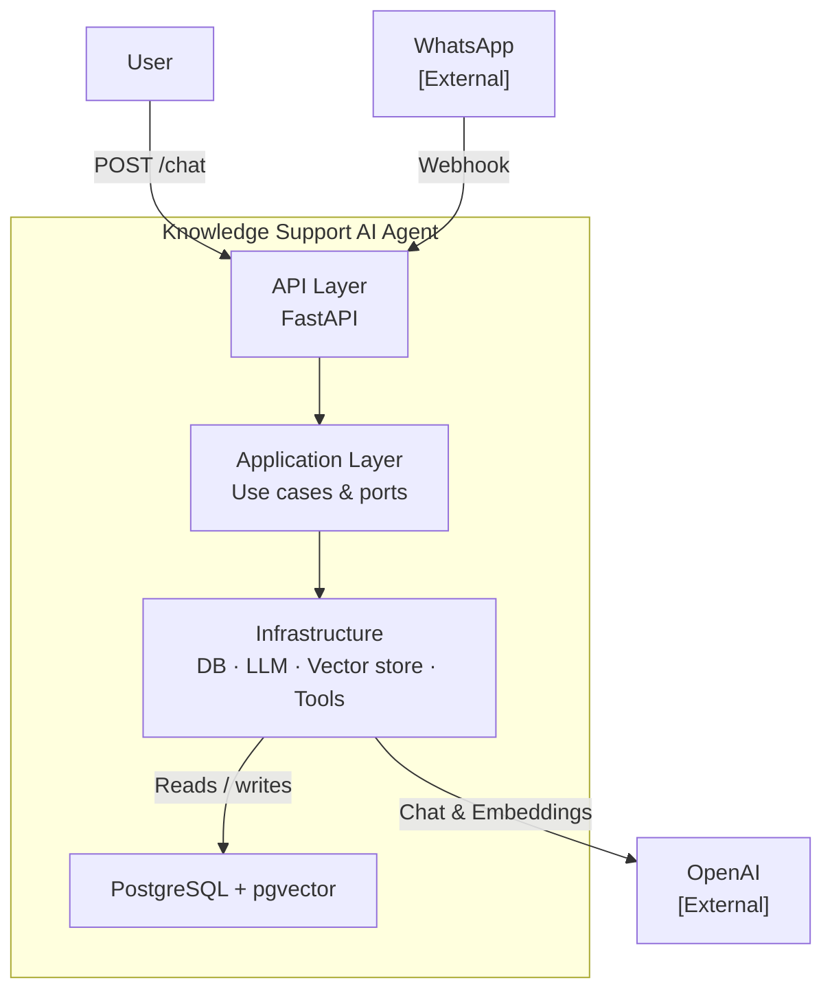

# Knowledge Support AI Agent

[](https://github.com/camercadop/knowledge-support-ai-agent/actions/workflows/ci.yml)

A production-grade reference implementation of a conversational AI support agent. Built to demonstrate how to structure a real-world AI backend using Clean Architecture — with RAG, semantic memory, persistent chat history, and provider independence baked in from the start.

The goal is to show that AI-powered applications don't have to be prototype spaghetti: business logic stays isolated from LLM providers, databases, and messaging platforms, making every layer independently testable and replaceable.

WhatsApp Cloud API is the intended communication channel, with a REST API available for direct integration and local development.

## Architecture



> See [Architecture](docs/architecture.md) for C4 Level 0–2 diagrams.

## Stack

- Python 3.13+, FastAPI, SQLAlchemy, Alembic
- PostgreSQL, pgvector
- OpenAI Responses API
- Docker, Docker Compose
- uv, Pytest, Ruff, MyPy, import-linter

## Prerequisites

- [Python 3.13+](https://www.python.org/downloads/)
- [uv](https://docs.astral.sh/uv/getting-started/installation/)
- [Docker & Docker Compose](https://docs.docker.com/get-docker/)
- An OpenAI API key

## Setup

```bash
git clone <repo-url>
cd knowledge-support-ai-agent

cp .env.example .env
# Fill in your values in .env

uv sync
docker compose up -d
uv run alembic upgrade head
```

## Configuration

| Variable | Description |
|----------|-------------|
| `DATABASE_URL` | PostgreSQL connection string |
| `CHAT_PROVIDER` | Chat provider: `openai`, `ollama`, `openrouter`, `mock` |
| `CHAT_API_KEY` | API key for the chat provider |
| `CHAT_MODEL` | Model name (e.g. `gpt-4o-mini`) |
| `CHAT_BASE_URL` | Optional base URL override for the chat provider |
| `EMBEDDING_PROVIDER` | Embedding provider: `openai`, `ollama`, `mock` |
| `EMBEDDING_API_KEY` | API key for the embedding provider |
| `EMBEDDING_MODEL` | Embedding model name (default: `text-embedding-3-small`) |
| `EMBEDDING_DIMENSIONS` | Embedding vector dimensions (default: `1536`) |
| `EMBEDDING_BASE_URL` | Optional base URL override for the embedding provider |
| `WHATSAPP_TOKEN` | WhatsApp Cloud API token |
| `WHATSAPP_VERIFY_TOKEN` | Webhook verification token |
| `LOG_LEVEL` | Log level: `DEBUG`, `INFO`, `WARNING` (default: `INFO`) |
| `LOG_FORMAT` | Log format: `text` for console, `json` for production (default: `text`) |

## Running

```bash
uv run uvicorn app.main:app --reload
```

API docs available at `http://localhost:8000/docs`.

## Trying it out

Send a chat message:

```bash
curl -X POST http://localhost:8000/chat \
  -H "Content-Type: application/json" \
  -d '{"phone": "+1234567890", "message": "Hello, what can you help me with?"}'
```

Ingest a document into the knowledge base:

```bash
curl -X POST http://localhost:8000/documents \
  -H "Content-Type: application/json" \
  -d '{"title": "My Doc", "source": "manual", "content": "Your document text here..."}'
```

Or use the interactive docs at `http://localhost:8000/docs`.

## Project Structure

```
app/
    api/              # Route handlers
    application/      # Use cases and orchestration
        models/       # Application-layer value objects
        ports/        # Abstract interfaces (ports)
            repositories/  # One abstract repo per aggregate root
            unit_of_work/  # Domain-scoped transactional boundaries
    config/           # Settings and logging configuration
    domain/           # Domain models and business logic
    infrastructure/
        ai/           # Chat and embedding provider clients
            tools/    # Tool registry, @tool decorator, and tool implementations
        database/     # ORM models, repositories, migrations
        vectorstores/ # Vector store implementations (pgvector)
    schemas/          # Pydantic request/response schemas
```

## Testing

```bash
uv run pytest
```

## Linting & Type Checking

```bash
uv run ruff check .
uv run mypy app/
uv run lint-imports
uv audit --preview-features audit-command
```

## Documentation

- [Architecture](docs/architecture.md)
- [Development Guide](docs/development.md)
- [Data Model](docs/data-model.md)
- [Architecture Decision Records](docs/adr/)

## License

MIT
