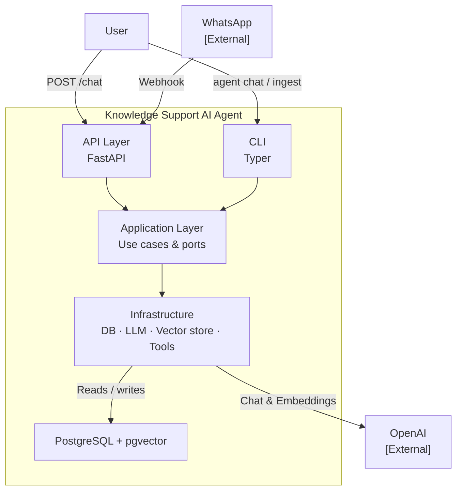

# Enterprise Knowledge AI Platform

[](https://github.com/camercadop/knowledge-support-ai-agent/actions/workflows/ci.yml)
[](https://github.com/astral-sh/ruff)
[](https://github.com/astral-sh/uv)
[](https://mypy-lang.org/)
[](https://www.python.org/downloads/)
[](LICENSE)

A production-grade reference implementation of a conversational AI support agent. Built to demonstrate how to structure a real-world AI backend using Clean Architecture — with RAG, semantic memory, persistent chat history, and provider independence baked in from the start.

The goal is to show that AI-powered applications don't have to be prototype spaghetti: business logic stays isolated from LLM providers, databases, and messaging platforms, making every layer independently testable and replaceable.

WhatsApp Cloud API is the intended communication channel, with a REST API available for direct integration and local development.

## Features

- Conversational chat with persistent history per contact
- RAG — knowledge chunks retrieved via semantic search on every turn
- Document ingestion — chunking, embedding, and pgvector indexing
- Tool calling — `search_documents` and `get_current_date` built in
- Conversation history optimization — pluggable retention policies (token limit, message count, role filter, summarization)
- Provider independence — chat and embedding providers are swappable at config time
- OpenTelemetry instrumentation — spans and metrics for use cases and RAG pipeline
- Rate limiting — moving-window algorithm via slowapi, configurable per environment
- Security headers — CSP, HSTS, X-Frame-Options, and more, all configurable
- WhatsApp Cloud API webhook integration (pending)
- REST API and CLI interfaces

## Architecture


```mermaid
flowchart TB
    user["User"]
    whatsapp["WhatsApp\n[External]"]
    openai["OpenAI\n[External]"]

    subgraph agent["Knowledge Support AI Agent"]
        api["API Layer\nFastAPI"]
        cli["CLI\nTyper"]
        app["Application Layer\nUse cases & ports"]
        infra["Infrastructure\nDB · LLM · Vector store · Tools"]
        db["PostgreSQL + pgvector"]
    end

    user -->|"POST /chat"| api
    user -->|"agent chat / ingest"| cli
    whatsapp -->|"Webhook"| api
    api --> app
    cli --> app
    app --> infra
    infra -->|"Chat & Embeddings"| openai
    infra -->|"Reads / writes"| db
```

> See [Architecture](docs/architecture.md) for C4 Level 0–2 diagrams.

## Stack

- Python 3.13+, FastAPI, Typer, SQLAlchemy, Alembic
- PostgreSQL, pgvector
- OpenAI Responses API
- Docker, Docker Compose
- uv, Pytest, Ruff, MyPy, import-linter

## Prerequisites

- [Python 3.13+](https://www.python.org/downloads/)
- [uv](https://docs.astral.sh/uv/getting-started/installation/)
- [Docker & Docker Compose](https://docs.docker.com/get-docker/)
- An OpenAI API key

## Setup

```bash
git clone <repo-url>
cd knowledge-support-ai-agent

cp .env.example .env
# Fill in your values in .env

uv sync
docker compose up -d
uv run alembic upgrade head
```

## Configuration

| Variable | Description |
|----------|-------------|
| `DATABASE_URL` | PostgreSQL connection string |
| `CHAT_PROVIDER` | Chat provider: `openai`, `ollama`, `openrouter`, `mock` |
| `CHAT_API_KEY` | API key for the chat provider |
| `CHAT_MODEL` | Model name (e.g. `gpt-4o-mini`) |
| `CHAT_BASE_URL` | Optional base URL override for the chat provider |
| `EMBEDDING_PROVIDER` | Embedding provider: `openai`, `ollama`, `mock` |
| `EMBEDDING_API_KEY` | API key for the embedding provider |
| `EMBEDDING_MODEL` | Embedding model name (default: `text-embedding-3-small`) |
| `EMBEDDING_DIMENSIONS` | Embedding vector dimensions — omit or leave empty to let the provider decide (default: `1536`) |
| `EMBEDDING_BASE_URL` | Optional base URL override for the embedding provider |
| `EMBEDDING_ENCODING_FORMAT` | Embedding encoding format: `float` or `base64` (default: `float`) |
| `RETRIEVAL_TOP_K` | Number of chunks to request from the vector store (default: `5`) |
| `RETRIEVAL_MIN_SCORE` | Maximum cosine distance to accept — lower is stricter (default: `0.7`) |
| `RETRIEVAL_MAX_CHUNKS` | Maximum deduplicated chunks included in context (default: `5`) |
| `RETRIEVAL_MAX_CONTEXT_TOKENS` | Token budget for assembled context (default: `2000`) |
| `RETRIEVAL_ENCODING` | tiktoken encoding for token counting (default: `cl100k_base`) |
| `CHUNK_STRATEGY` | Chunking strategy: `fixed`, `recursive`, `markdown` (default: `fixed`) |
| `CHUNK_SIZE` | Target chunk size in characters (default: `500`) |
| `CHUNK_OVERLAP` | Overlap between consecutive chunks in characters (default: `50`) |
| `CONVERSATION_MAX_MESSAGES` | Maximum number of messages kept in history before pruning (default: `50`) |
| `CONVERSATION_MAX_TOKENS` | Token budget for conversation history (default: `2000`) |
| `CONVERSATION_SUMMARY_MAX_TOKENS` | Token threshold that triggers summarization (default: `1000`) |
| `CONVERSATION_SUMMARY_MAX_MESSAGES` | Message count threshold that triggers summarization (default: `5`) |
| `OTEL_ENABLED` | Enable OpenTelemetry instrumentation (default: `false`) |
| `OTEL_ENDPOINT` | OTLP exporter endpoint (default: `http://localhost:4318`) |
| `OTEL_SERVICE_NAME` | Service name reported to the collector (default: `knowledge-support-ai-agent`) |
| `WHATSAPP_TOKEN` | WhatsApp Cloud API token |
| `WHATSAPP_VERIFY_TOKEN` | Webhook verification token |
| `CORS_ORIGINS` | Comma-separated list of allowed CORS origins (default: empty, which denies all) |
| `RATE_LIMIT_ENABLED` | Enable rate limiting on all endpoints (default: `true`) |
| `RATE_LIMIT_DEFAULT` | Maximum requests per minute per IP (default: `60`) |
| `SECURITY_HEADERS_ENABLED` | Enable security headers middleware (default: `true`) |
| `SECURITY_HEADERS_CONTENT_SECURITY_POLICY` | `Content-Security-Policy` header value (default: `default-src 'none'; frame-ancestors 'none'`) |
| `SECURITY_HEADERS_X_CONTENT_TYPE_OPTIONS` | `X-Content-Type-Options` header value (default: `nosniff`) |
| `SECURITY_HEADERS_X_FRAME_OPTIONS` | `X-Frame-Options` header value (default: `DENY`) |
| `SECURITY_HEADERS_STRICT_TRANSPORT_SECURITY` | `Strict-Transport-Security` header value (default: `max-age=31536000; includeSubDomains`) |
| `SECURITY_HEADERS_REFERRER_POLICY` | `Referrer-Policy` header value (default: `strict-origin-when-cross-origin`) |
| `LOG_LEVEL` | Log level: `DEBUG`, `INFO`, `WARNING` (default: `INFO`) |
| `LOG_FORMAT` | Log format: `text` for console, `json` for production (default: `text`) |

## Running

### API

```bash
uv run uvicorn app.main:app --reload
```

API docs available at `http://localhost:8000/docs`.

### CLI

```bash
uv run python -m app.cli.main --help
```

## Trying it out

### Via API

Send a chat message:

```bash
curl -X POST http://localhost:8000/chat \
  -H "Content-Type: application/json" \
  -d '{"phone": "+1234567890", "message": "Hello, what can you help me with?"}'
```

Ingest a document into the knowledge base:

```bash
curl -X POST http://localhost:8000/documents \
  -H "Content-Type: application/json" \
  -d '{"title": "My Doc", "source": "manual", "content": "Your document text here..."}'
```

Or use the interactive docs at `http://localhost:8000/docs`.

### Via CLI

Start an interactive chat session:

```bash
uv run python -m app.cli.main support chat --phone "+1234567890"
```

Ingest a document from a file:

```bash
uv run python -m app.cli.main support ingest --file ./doc.txt --title "My Doc"
```

Clear a contact's chat history:

```bash
uv run python -m app.cli.main support clear-history --phone "+1234567890"
```

Each agent reply includes a citations table showing the source documents and their similarity score (higher is better).

## Project Structure

```
app/
    api/              # Route handlers
    application/      # Use cases and orchestration, organized by domain
        shared/       # Cross-domain event infrastructure
        <domain>/     # One sub-package per domain
            models/       # Application-layer value objects
            ports/        # Abstract interfaces (ports)
                repositories/  # One abstract repo per aggregate root
                unit_of_work/  # Domain-scoped transactional boundaries
            services/     # Shared application-layer services
            use_cases/    # One module per user-facing action
    cli/              # Typer CLI entry point
        commands/     # One module per command group
        context.py    # Request context manager (container + session lifecycle)
    config/           # Settings and logging configuration
    container/        # Composition Root — ApplicationContainer composes domain-scoped containers
    domain/           # Domain models and business logic
    infrastructure/
        ai/           # Chat and embedding provider implementations
            chunking/       # Chunking strategy implementations
            history_policies/ # Message retention policy implementations
            prompt_builder/ # PromptBuilder implementations
            tools/    # Tool registry, @tool decorator, and tool implementations
        analytics/    # Event handlers for analytics domain
        database/
            sqlalchemy/ # Models, repositories, migrations, and PostgreSQL engine
        events/       # In-memory event bus
        middleware/   # ASGI middleware (security headers, rate limiting, request size limiting)
        vectorstores/ # Vector store implementations (pgvector)
        observability/ # OTel instrumentation
    schemas/          # Pydantic schemas

tests/
    api/              # mirrors app/api/
    application/      # mirrors app/application/
    infrastructure/   # mirrors app/infrastructure/
    conftest.py       # shared fixtures
```

## Retrieval & Similarity Scoring

The RAG pipeline uses **cosine distance** to measure how relevant a knowledge chunk is to the user's query.

- Range: `0.0` to `1.0` — lower means more similar
- `0.0` = identical vectors (perfect match)
- `1.0` = completely unrelated

Citations shown after each agent reply display a **Similarity %**, which is `(1 - cosine_distance) × 100`. A chunk at distance `0.2` shows as `80%` similarity.

`RETRIEVAL_MIN_SCORE` controls the maximum cosine distance accepted. Chunks above this threshold are filtered out before being passed to the LLM. The default of `0.7` works well for most embedding models, but you may need to tune it depending on your provider:

| Embedding provider | Recommended `RETRIEVAL_MIN_SCORE` |
|--------------------|-----------------------------------|
| OpenAI | `0.4` – `0.5` |
| Nvidia | `0.6` – `0.8` |
| Ollama (nomic-embed-text) | `0.5` – `0.7` |

## Testing

```bash
uv run pytest
```

## Linting & Type Checking

```bash
uv run ruff check .
uv run mypy app/
uv run lint-imports
```

## Dependency Audit

```bash
uv audit --preview-features audit-command
```

## Documentation

- [Architecture](docs/architecture.md) — C4 diagrams (context, container, component) and request flow sequences
- [Development Guide](docs/development.md) — conventions, local setup, testing, linting, and code style rules
- [Security](docs/security.md) — implemented security controls and rules
- [Data Model](docs/data-model.md) — database conventions, base model fields, and migration rules
- [Architecture Decision Records](docs/adr/) — formal, binding decisions that shaped the system design
- [Guidelines](docs/guidelines/) — how-to references for implementing common patterns correctly
- [Roadmap](Roadmap.md) — product roadmap and implementation status
- [Vision](docs/vision.md) — product vision and strategic direction
- [Contributing](CONTRIBUTING.md) — branching, commit conventions, and PR process

## License

MIT
