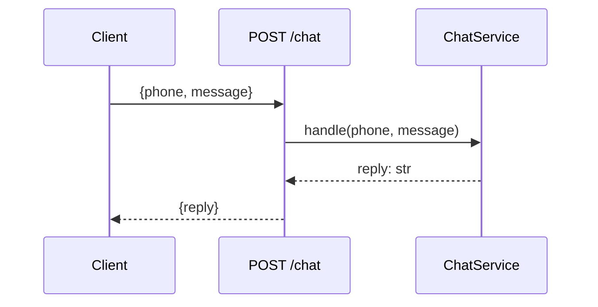

# api

This package is the HTTP entry point of the application. It contains FastAPI route handlers organized by feature area. Each module defines an `APIRouter` that is mounted in `app.main`. Handlers are intentionally thin: they validate the incoming request via schemas, delegate all business logic to the application layer, and return the serialized response. No domain logic lives here.

## Endpoints

| Method | Path | Description |
|--------|------|-------------|
| `POST` | `/chat` | Receive a user message and return the assistant reply |

## Request / Response flow

## Modules

- `chat.py` — `/chat` endpoint; delegates all logic to `ChatService`
