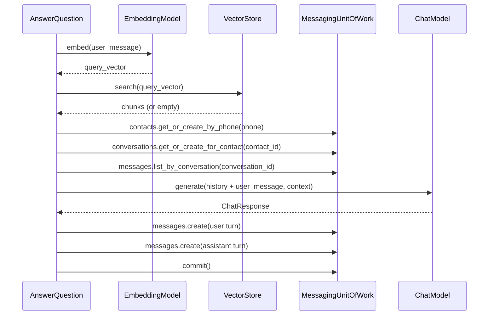
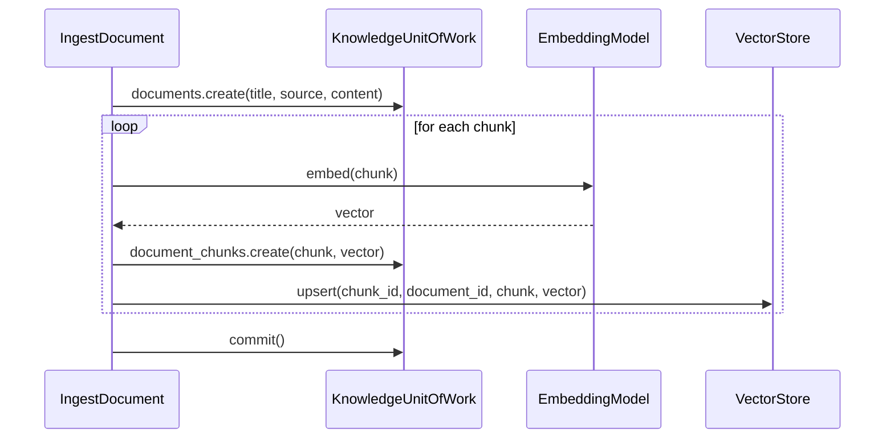

# support

This sub-package handles the support use case. `AnswerQuestion` orchestrates a full chat turn: it resolves the contact and conversation, retrieves message history, calls the LLM, persists both the user and assistant turns, and returns the reply text to the API layer.

## Responsibilities

- Coordinate repositories, the LLM client, and the database session
- Own the transaction boundary: commit only after all side effects succeed
- Return plain values to the API layer; never expose ORM objects

## Flow

### AnswerQuestion

### IngestDocument

## Modules

- `answer_question.py` — `AnswerQuestion`; handles a full chat turn end-to-end
- `ingest_document.py` — `IngestDocument`; chunks, embeds, and indexes a document into the knowledge base
