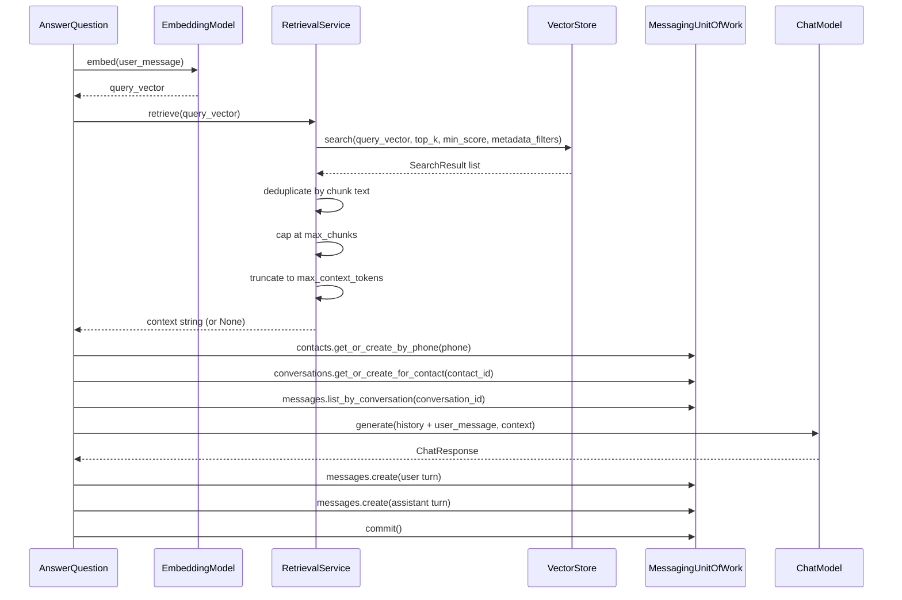
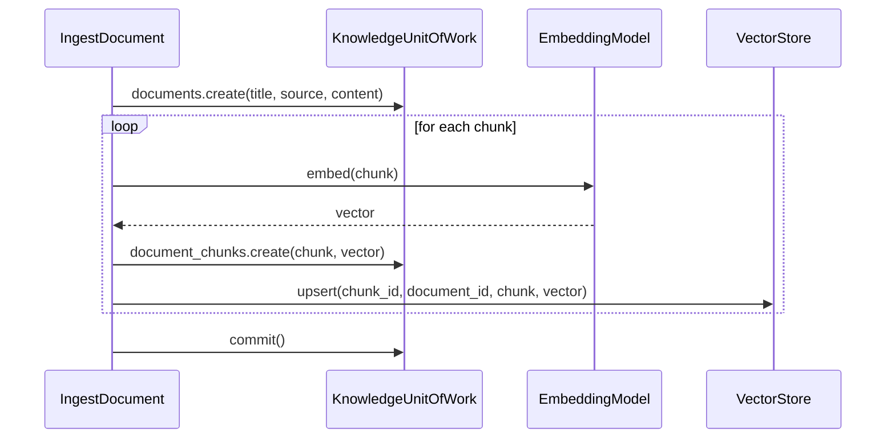

# support

This sub-package handles the support use case. `AnswerQuestion` orchestrates a full chat turn: it resolves the contact and conversation, retrieves message history, calls the LLM, persists both the user and assistant turns, and returns the reply text to the API layer.

## Responsibilities

- Coordinate repositories, the LLM client, and the database session
- Own the transaction boundary: commit only after all side effects succeed
- Return plain values to the API layer; never expose ORM objects

## Flow

### AnswerQuestion

1. Embed the user message into a query vector
2. Retrieve relevant knowledge chunks via semantic search, applying deduplication, max-chunks cap, and token budget
3. Resolve the contact by phone, creating one if it doesn't exist
4. Resolve the active conversation for that contact, creating one if needed
5. Load the conversation's message history
6. Build the full prompt: system prompt + retrieved context + history + user message
7. Call the LLM, optionally invoking tools during generation
8. Persist the user turn and the assistant reply
9. Commit the transaction
10. Return the reply text to the caller

### IngestDocument

1. Persist the document (title, source, raw content) via the UoW
2. Split the content into chunks using the configured chunk strategy
3. For each chunk:
   - Embed the chunk text into a vector
   - Persist the chunk and its embedding via the UoW
   - Upsert the chunk into the vector store for similarity search
4. Commit the transaction
5. Return the persisted Document to the caller

## Modules

- `answer_question.py` — `AnswerQuestion`; handles a full chat turn end-to-end
- `ingest_document.py` — `IngestDocument`; chunks, embeds, and indexes a document into the knowledge base
- `retrieval_service.py` — `RetrievalService`; wraps `VectorStore.search()` with post-retrieval quality controls: deduplication by chunk text, max-chunks cap, and token-based context truncation via tiktoken