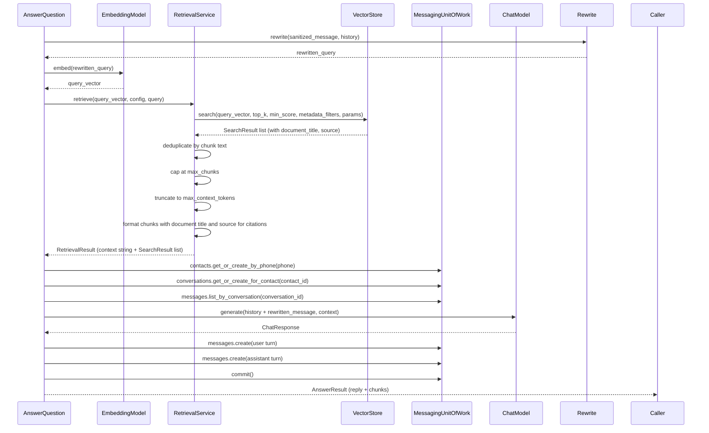
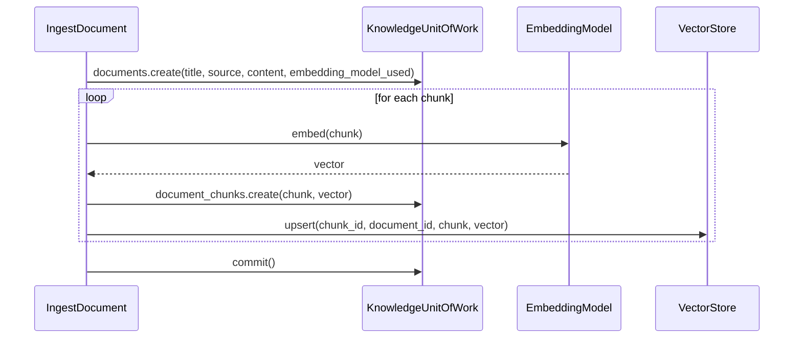

# support

This sub-package contains everything belonging to the support domain: models, ports, services, and use cases.

## Structure

- `models/` — infrastructure-free dataclasses used as return types by repository ports
- `ports/` — abstract interfaces the use cases depend on
  - `repositories/` — one abstract repository per aggregate root
  - `unit_of_work/` — domain-scoped transactional boundaries (`MessagingUnitOfWork`, `KnowledgeUnitOfWork`)
  - `chat_model.py` — `ChatModel`, `ChatMessage`, `ChatResponse`, `ChatModelOverrides` (per-call model, max_tokens, temperature overrides)
  - `settings_resolver.py` — `SettingsResolver`; resolves settings keys with optional KB config overrides
  - `embedding_model.py`, `prompt_builder.py`, `tool_registry.py`, `observability.py`, `chunk_strategy.py`, `vector_store.py`, `search_params_builder.py`
- `services/` — shared application-layer logic consumed by multiple use cases
  - `chunk_retriever.py` — wraps vector store search with deduplication, capping, and token budget enforcement
- `use_cases/` — one module per user-facing action

## Use Cases

### AnswerQuestion

1. Resolve settings for the current KB (retrieval config, prompt overrides, chat model overrides) via the injected `SettingsResolver`; falls back to global settings when no resolver is provided
2. Sanitize the user message to neutralize prompt injection attempts
3. Rewrite the sanitized query using the QueryRewriter (if enabled)
4. Embed the rewritten query into a query vector
5. Retrieve relevant knowledge chunks via semantic or hybrid search, building a `RetrievalConfig` from the resolved settings and applying deduplication, max-chunks cap, and token budget
6. Resolve the contact by phone, creating one if it doesn't exist
7. Resolve the active conversation for that contact, creating one if needed
8. Load the conversation's message history
9. Build the full prompt: system prompt + retrieved context + history + rewritten user message
10. Call the LLM with `ChatModelOverrides` (model, max_tokens, temperature) resolved per KB, optionally invoking tools during generation
11. Persist the user turn and the assistant reply
12. Commit the transaction
13. Return an `AnswerResult` with the reply text and the list of retrieved chunks to the caller

```mermaid
sequenceDiagram
    participant UC as AnswerQuestion
    participant Embed as EmbeddingModel
    participant RS as RetrievalService
    participant VS as VectorStore
    participant UoW as MessagingUnitOfWork
    participant LLM as ChatModel

    UC->>Rewrite: rewrite(sanitized_message, history)
    Rewrite-->>UC: rewritten_query
    UC->>Embed: embed(rewritten_query)
    Embed-->>UC: query_vector
    UC->>RS: retrieve(query_vector, config, query)
    RS->>VS: search(query_vector, top_k, min_score, metadata_filters, params)
    VS-->>RS: SearchResult list (with document_title, source)
    RS->>RS: deduplicate by chunk text
    RS->>RS: cap at max_chunks
    RS->>RS: truncate to max_context_tokens
    RS->>RS: format chunks with document title and source for citations
    RS-->>UC: RetrievalResult (context string + SearchResult list)
    UC->>UoW: contacts.get_or_create_by_phone(phone)
    UC->>UoW: conversations.get_or_create_for_contact(contact_id)
    UC->>UoW: messages.list_by_conversation(conversation_id)
    UC->>LLM: generate(history + rewritten_message, context)
    LLM-->>UC: ChatResponse
    UC->>UoW: messages.create(user turn)
    UC->>UoW: messages.create(assistant turn)
    UC->>UoW: commit()
    UC-->>Caller: AnswerResult (reply + chunks)
```

### IngestDocument

1. Persist the document (title, source, raw content, embedding_model_used) via the UoW
2. Split the content into chunks using the configured chunk strategy
3. For each chunk:
    - Embed the chunk text into a vector
    - Persist the chunk and its embedding via the UoW
    - Upsert the chunk into the vector store for similarity search
4. Commit the transaction
5. Return the persisted Document to the caller

```mermaid
sequenceDiagram
    participant UC as IngestDocument
    participant UoW as KnowledgeUnitOfWork
    participant Embed as EmbeddingModel
    participant VS as VectorStore

    UC->>UoW: documents.create(title, source, content, embedding_model_used)
    loop for each chunk
        UC->>Embed: embed(chunk)
        Embed-->>UC: vector
        UC->>UoW: document_chunks.create(chunk, vector)
        UC->>VS: upsert(chunk_id, document_id, chunk, vector)
    end
    UC->>UoW: commit()
```

### KnowledgeBaseCRUD

Provides standard CRUD operations for knowledge bases: create, list, get by id, update, and delete.

### ClearHistory

Deletes all messages for the conversation associated with a phone number.
