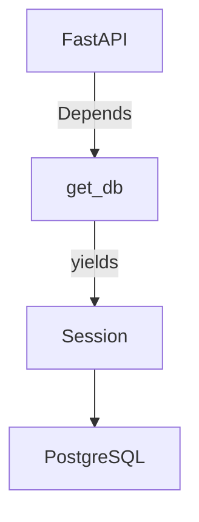

# database

This sub-package sets up the SQLAlchemy engine, session factory, and the shared declarative base used by all ORM models.

## Session lifecycle

`get_db` is a FastAPI dependency that opens a session, yields it to the handler, and closes it when the request is done regardless of outcome.

## Modules

- `base.py` — `Base` declarative base; provides `id` (UUID), `created_at`, and `updated_at` to every model that inherits from it
- `engine.py` — creates the engine from `settings.database_url`, defines the `SessionLocal` factory, and exposes the `get_db` dependency
