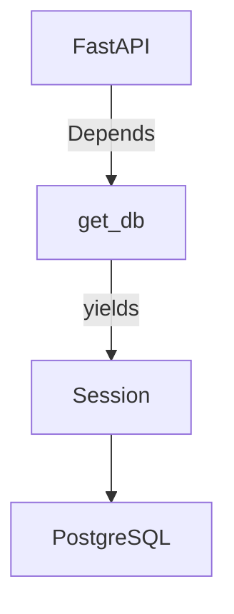
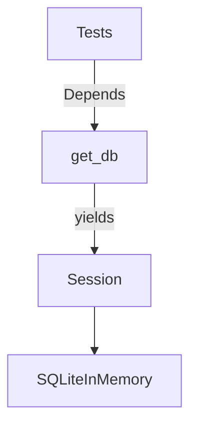

# database

This sub-package organizes database backends by ORM/driver. Each backend lives in its own subdirectory and is fully self-contained.

## Structure

```
database/
    sqlalchemy/
        migrations/       # Alembic migrations (ORM-specific, shared across backends)
        postgresql/       # PostgreSQL backend
            models/
            repositories/
            unit_of_work/
            base.py       # Declarative base with id, created_at, updated_at
            engine.py     # PostgreSQL engine, SessionLocal, and get_db dependency
        sqlite/           # SQLite backend
            engine.py     # In-memory SQLite engine and get_db dependency for tests
```

## sqlalchemy/postgresql

`get_db` is a FastAPI dependency that opens a session, yields it to the handler, and closes it when the request is done regardless of outcome.



## sqlalchemy/sqlite

Provides an in-memory SQLite session factory that reuses the same SQLAlchemy models and `Base.metadata`. Intended for tests only — not suitable for production.


