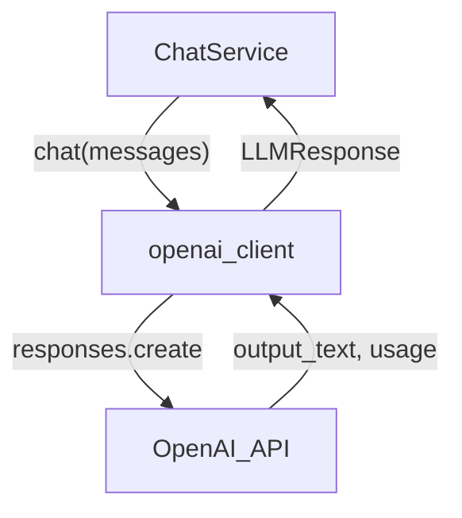

# llm

This sub-package wraps the OpenAI Responses API. It exposes a single `chat` function that the application layer calls without knowing any SDK details.

## Flow

## Modules

- `openai_client.py` — `chat(messages)` function; prepends the system prompt, filters unknown roles, calls the API, and returns an `LLMResponse` with `content` and `total_tokens`
