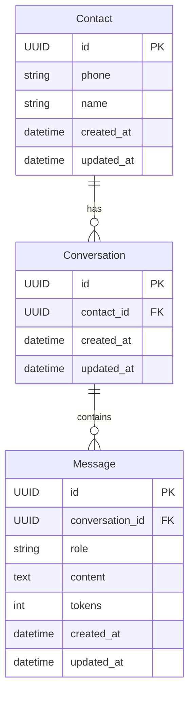

# models

This package contains the SQLAlchemy ORM models that map to database tables. Each model represents a core domain entity and defines its columns, constraints, and relationships. All models inherit from `Base` (defined in `infrastructure/database/base.py`), which provides a UUID primary key and automatic `created_at` / `updated_at` timestamps.

## Entity relationship

