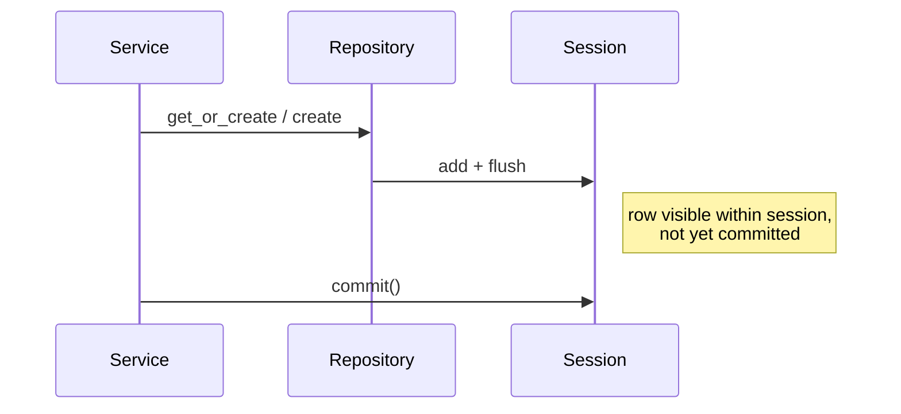

# repositories

This package is the data access layer. Each repository class wraps one ORM model and exposes only the specific queries the application needs, keeping raw SQLAlchemy out of the service layer. Repositories flush changes to the session but never commit; the calling service owns the transaction boundary.

## Modules

| Class | Model | Key methods |
|-------|-------|-------------|
| `ContactRepository` | `Contact` | `get_or_create_by_phone(phone)` |
| `ConversationRepository` | `Conversation` | `get_or_create_for_contact(contact_id)` |
| `MessageRepository` | `Message` | `list_by_conversation(conversation_id)`, `create(...)` |

## Transaction boundary

