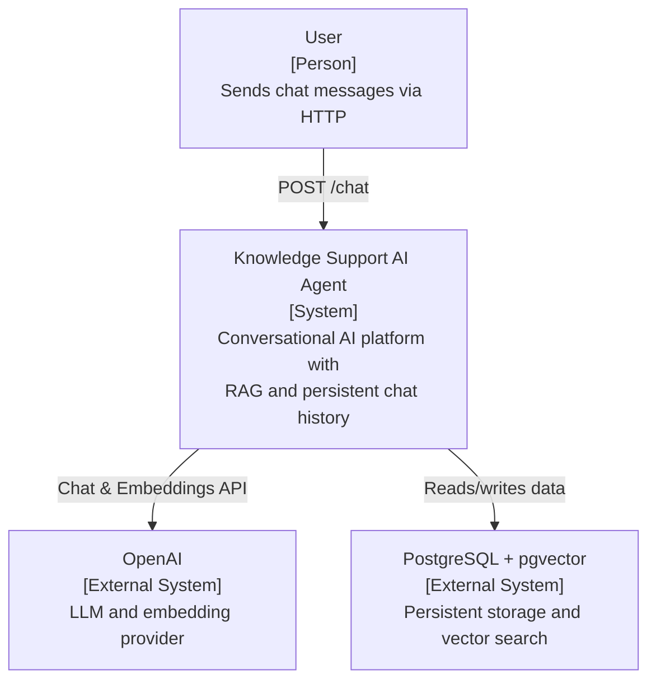
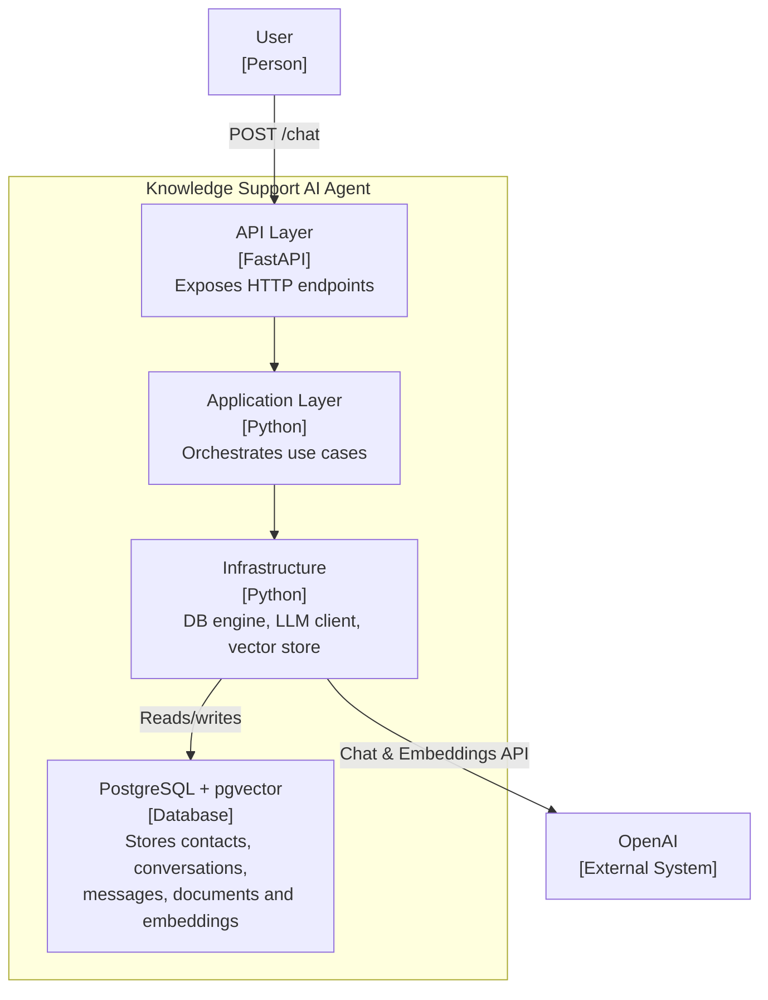
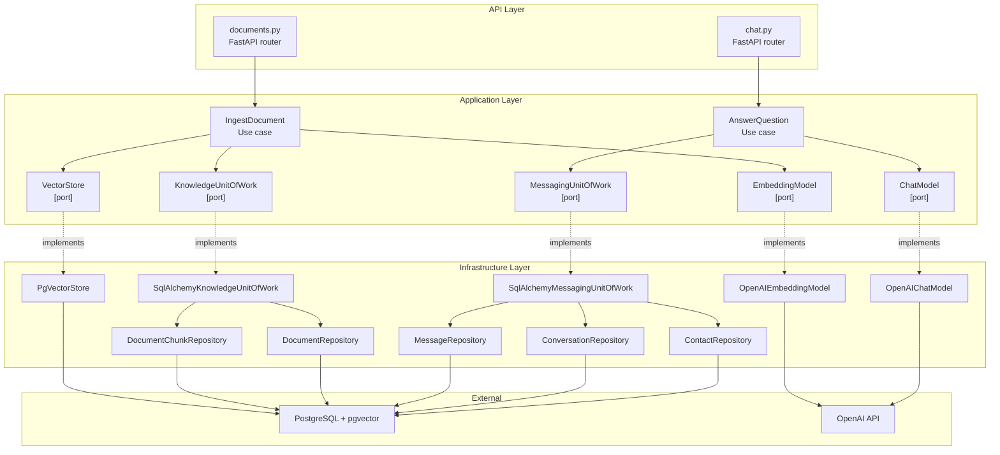

# Architecture

## Overview

Knowledge Support AI Agent is a FastAPI backend that implements a conversational AI platform using RAG, semantic memory, tool calling, and Clean Architecture. WhatsApp Cloud API is the communication channel.

## C4 Level 0 — System Context



## C4 Level 1 — Container



## C4 Level 2 — Component



## Code Structure

```
app/
    api/              # Route handlers and webhook endpoints
    config/           # Settings and environment configuration
    domain/           # Domain models and business logic
    application/      # Use cases and orchestration
        models/       # Application-layer value objects
        ports/        # Interfaces for infrastructure dependencies
            repositories/   # One abstract repo per aggregate root
            unit_of_work/   # Domain-scoped transactional boundaries
    infrastructure/   # External integrations (DB, LLM, WhatsApp)
        ai/
            chat/       # Chat completion provider implementations
            embeddings/ # Embedding provider implementations
            mock/       # Mock implementations for testing
        database/       # Models, repositories, and migrations
        vectorstores/
            pgvector/   # PgVectorStore — cosine similarity search via pgvector
    schemas/          # Pydantic schemas

tests/
```

## Infrastructure

- PostgreSQL 17 with pgvector extension for vector similarity search.
- Docker Compose manages the local database instance.

## Key Design Decisions

- See `docs/adr/` for all accepted architectural decisions.
