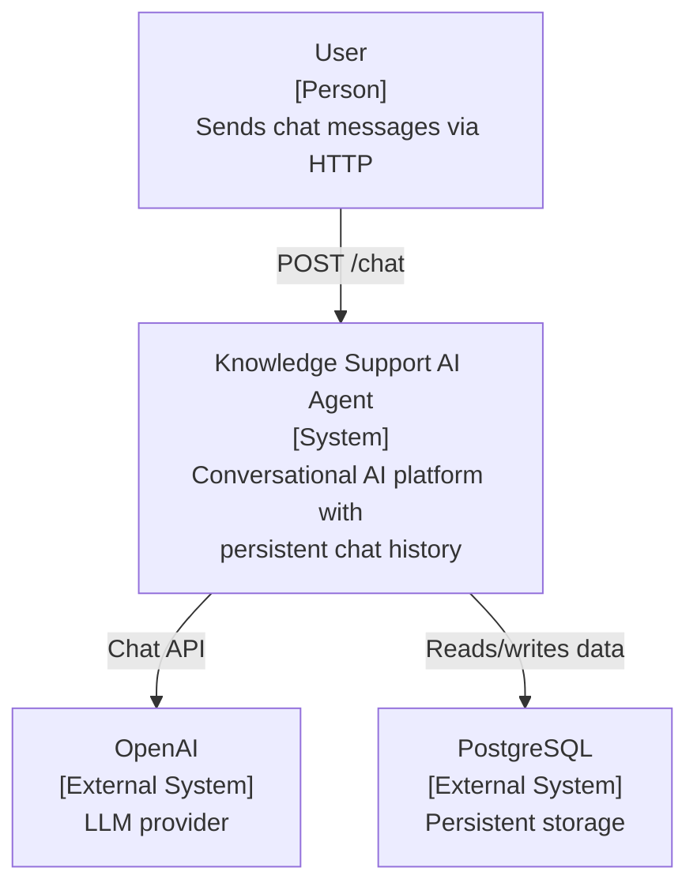
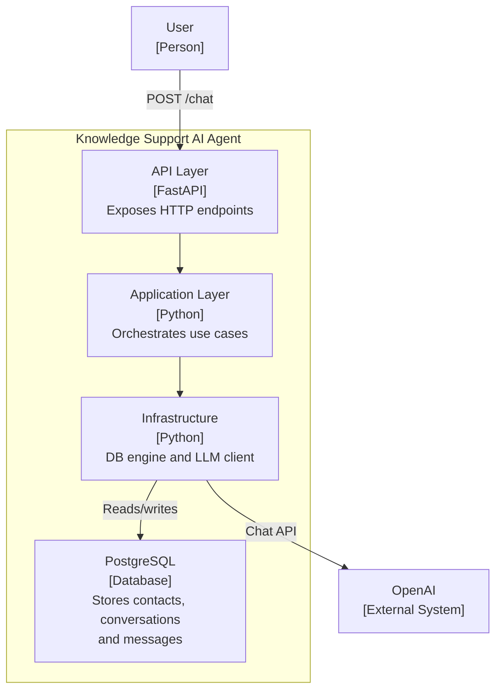
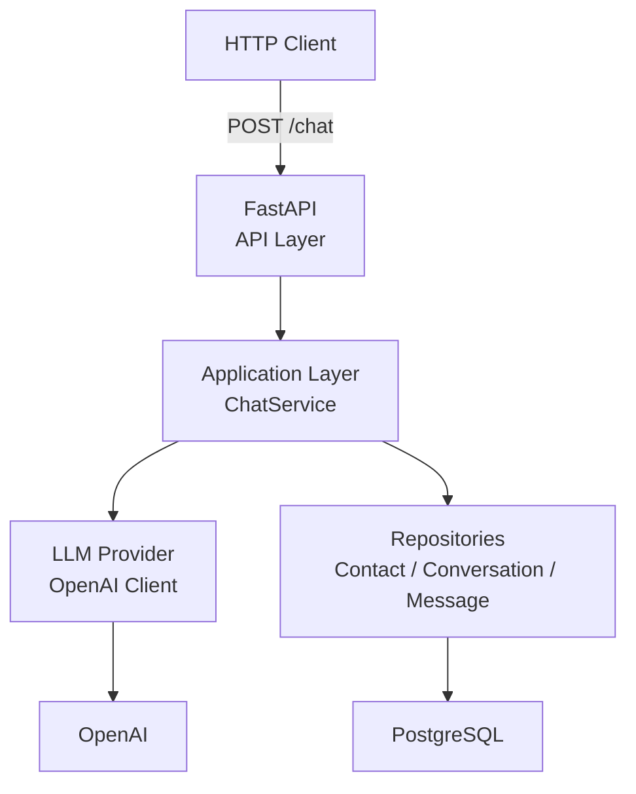

# Architecture

## Overview

Knowledge Support AI Agent is a FastAPI backend that implements a conversational AI platform using RAG, semantic memory, tool calling, and a layered architecture. WhatsApp Cloud API is the communication channel.

## C4 Level 0 — System Context



## C4 Level 1 — Container



## System Layers



## Code Structure

```
app/
    api/              # Route handlers and webhook endpoints
    core/             # Shared utilities and base classes
    config/           # Settings and environment configuration
    domain/           # Domain models and business logic
    application/      # Use cases and orchestration
    infrastructure/   # External integrations (DB, LLM, WhatsApp)
    repositories/     # Data access layer
    models/           # SQLAlchemy models
    schemas/          # Pydantic schemas
    workers/          # Background tasks

tests/
```

## Infrastructure

- PostgreSQL 17 with pgvector extension for vector similarity search.
- Docker Compose manages the local database instance.

## Key Design Decisions

- See `docs/adr/` for all accepted architectural decisions.
