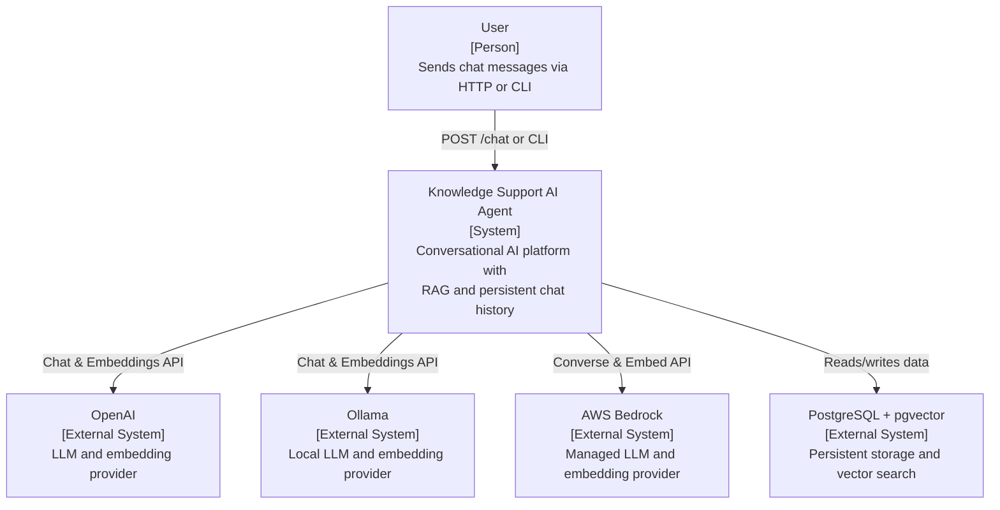
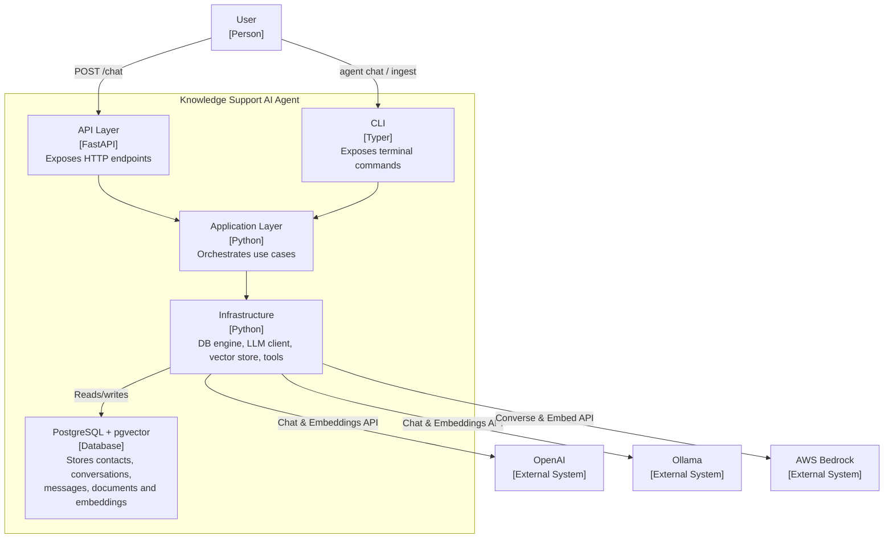

# Architecture

## Overview

Knowledge Support AI Agent is a conversational AI platform using RAG, semantic memory, tool calling, and Clean Architecture. It exposes two entry points: a FastAPI HTTP API and a Typer CLI. WhatsApp Cloud API is the intended external communication channel.

## C4 Level 0 — System Context


```mermaid
flowchart TB
    user["User\n[Person]\nSends chat messages via HTTP or CLI"]
    agent["Knowledge Support AI Agent\n[System]\nConversational AI platform with\nRAG and persistent chat history"]
    openai["OpenAI\n[External System]\nLLM and embedding provider"]
    ollama["Ollama\n[External System]\nLocal LLM and embedding provider"]
    bedrock["AWS Bedrock\n[External System]\nManaged LLM and embedding provider"]
    postgres["PostgreSQL + pgvector\n[External System]\nPersistent storage and vector search"]

    user -->|"POST /chat or CLI"| agent
    agent -->|"Chat & Embeddings API"| openai
    agent -->|"Chat & Embeddings API"| ollama
    agent -->|"Converse & Embed API"| bedrock
    agent -->|"Reads/writes data"| postgres
```

## C4 Level 1 — Container


```mermaid
flowchart TB
    user["User\n[Person]"]
    openai["OpenAI\n[External System]"]
    ollama["Ollama\n[External System]"]
    bedrock["AWS Bedrock\n[External System]"]

    subgraph agent["Knowledge Support AI Agent"]
        api["API Layer\n[FastAPI]\nExposes HTTP endpoints"]
        cli["CLI\n[Typer]\nExposes terminal commands"]
        app["Application Layer\n[Python]\nOrchestrates use cases"]
        infra["Infrastructure\n[Python]\nDB engine, LLM client, vector store, tools"]
        db["PostgreSQL + pgvector\n[Database]\nStores contacts, conversations,\nmessages, documents and embeddings"]
    end

    user -->|"POST /chat"| api
    user -->|"agent chat / ingest"| cli
    api --> app
    cli --> app
    app --> infra
    infra -->|"Chat & Embeddings API"| openai
    infra -->|"Chat & Embeddings API"| ollama
    infra -->|"Converse & Embed API"| bedrock
    infra -->|"Reads/writes"| db
```

## C4 Level 2 — Component


```mermaid
flowchart TB
    subgraph entry["Entry Points"]
        chat_router["chat.py\nFastAPI router"]
        docs_router["documents.py\nFastAPI router"]
        analytics_router["analytics.py\nFastAPI router"]
        cli_main["main.py\nTyper app"]
    end

    subgraph app["Application Layer"]
        subgraph use_cases["Use Cases"]
            uc_answer["AnswerQuestion"]
            uc_ingest["IngestDocument"]
            uc_export["ExportRagInteractions"]
            retrieval_svc["ChunkRetriever"]
            history_opt["ConversationHistoryOptimizer"]
        end
        subgraph ports["Ports"]
            port_uow["UnitOfWork"]
            port_chat["ChatModel"]
            port_embed["EmbeddingModel"]
            port_vs["VectorStore"]
            port_tools["ToolRegistry"]
            port_prompt["PromptBuilder"]
            port_event["EventPublisher"]
            port_obs["BaseInstrumentation"]
            port_retention["MessageRetentionPolicy"]
            port_rewrite["QueryRewriter"]
            port_strategy["SearchStrategy"]
        end
    end

    subgraph infra["Infrastructure Layer"]
        subgraph db_impl["Database"]
            sql_msg_uow["SqlAlchemyMessagingUoW\nContactRepo · ConvRepo · MsgRepo"]
            sql_know_uow["SqlAlchemyKnowledgeUoW\nDocRepo · ChunkRepo"]
            sql_analytics_uow["SqlAlchemyAnalyticsUoW\nRagInteractionLogRepo"]
            pgvector["PgVectorStore"]
        end
        subgraph ai_impl["AI"]
              openai_chat["OpenAIChatModel"]
              ollama_chat["OllamaChatModel"]
              bedrock_chat["BedrockChatModel"]
              openai_embed["OpenAIEmbeddingModel"]
              ollama_embed["OllamaEmbeddingModel"]
              bedrock_embed["BedrockEmbeddingModel"]
              default_prompt["DefaultPromptBuilder"]
              tool_registry["ConcreteToolRegistry\nget_current_date · search_documents"]
              history_policies["History Policies\nMessageCountPolicy · TokenLimitPolicy\nSummaryPolicy · RoleFilterPolicy"]
              query_rewriter["QueryRewriter\nPassthroughQueryRewriter · LLMQueryRewriter"]
              search_strategies["SearchStrategies\nVectorSearchStrategy · HybridSearchStrategy"]
        end
        subgraph events_impl["Events"]
            event_bus["InMemoryEventBus"]
            rag_handler["RagInteractionLogHandler"]
        end
        subgraph obs_impl["Observability"]
            otel_instrumentation["OtelDefaultInstrumentation"]
            null_instrumentation["NullInstrumentation"]
        end
    end

    subgraph external["External"]
        postgres[("PostgreSQL + pgvector")]
        openai["OpenAI API"]
        ollama["Ollama"]
        bedrock["AWS Bedrock"]
    end

    chat_router --> uc_answer
    docs_router --> uc_ingest
    analytics_router --> uc_export
    cli_main --> uc_answer
    cli_main --> uc_ingest

    uc_answer --> port_uow & port_chat & port_tools & port_prompt & retrieval_svc & port_event & port_obs & history_opt & port_rewrite
    uc_export --> port_uow
    retrieval_svc --> port_vs
    retrieval_svc --> port_strategy
    uc_ingest --> port_uow & port_embed & port_vs & port_obs
    history_opt --> port_retention

    port_uow -.->|impl| sql_msg_uow
    port_uow -.->|impl| sql_know_uow
    port_uow -.->|impl| sql_analytics_uow
    port_chat -.->|impl| openai_chat
    port_chat -.->|impl| ollama_chat
    port_chat -.->|impl| bedrock_chat
    port_embed -.->|impl| openai_embed
    port_embed -.->|impl| ollama_embed
    port_embed -.->|impl| bedrock_embed
    port_vs -.->|impl| pgvector
    port_tools -.->|impl| tool_registry
    port_prompt -.->|impl| default_prompt
    port_event -.->|impl| event_bus
    event_bus -->|dispatches| rag_handler
    port_obs -.->|impl| otel_instrumentation
    port_retention -.->|impl| history_policies
    port_rewrite -.->|impl| query_rewriter
    port_strategy -.->|impl| search_strategies

    sql_msg_uow & sql_know_uow & sql_analytics_uow & pgvector --> postgres
    openai_chat & openai_embed --> openai
    ollama_chat & ollama_embed --> ollama
    bedrock_chat & bedrock_embed --> bedrock
```

## Code Structure

```
app/
    api/              # Route handlers
    application/      # Use cases and orchestration, organized by domain
        shared/       # Cross-domain abstractions reused across all domains
            security/ # Application-layer security utilities
        <domain>/     # One sub-package per domain
            events/       # Domain events
            exceptions/   # Domain-specific exceptions
            models/       # Application-layer value objects
            ports/        # Interfaces for infrastructure dependencies
                repositories/   # One abstract repo per aggregate root
            services/     # Shared application-layer services
            use_cases/    # One module per user-facing action
    cli/              # Typer CLI entry point
        commands/     # One module per command group
    config/           # Settings and environment configuration
    container/        # Composition root
    domain/           # Domain models and business logic
    infrastructure/   # Adapters for all external systems
        ai/
            chat/             # Chat completion adapters
            chunking/         # Chunking strategy adapters
            context_compressor/ # Context compression strategy adapters
            embeddings/       # Embedding adapters
            history_policies/ # Message retention policy adapters
            message_sanitizer/ # Message sanitizer adapters
            mock/             # In-process test doubles
            prompt_builder/   # Prompt builder adapters
            query_rewriter/   # Query rewriter adapters
            tools/            # Tool registry and built-in tool implementations
        analytics/        # Event handlers for the analytics domain
        database/
            sqlalchemy/
                migrations/   # Alembic migrations
                postgresql/   # PostgreSQL ORM models, repositories, and units of work
                sqlite/       # SQLite engine for lightweight environments
        events/           # Event bus adapters
        middleware/       # ASGI middleware
        observability/    # OTel instrumentation
            definitions/  # Instrumentation config constants grouped by domain
        core/             # Cross-cutting infrastructure utilities
        routers/          # Reusable router utilities
        security/         # Infrastructure-layer security adapters
        vectorstores/
            fake/           # In-process vector store for testing
            pgvector/       # pgvector adapter
            search_strategies/ # SearchStrategy implementations and registry
    schemas/          # Pydantic request and response schemas

tests/
```

## Infrastructure

- PostgreSQL 17 with pgvector extension for vector similarity search.
- Docker Compose manages the local database instance.

## Key Design Decisions

- See `docs/adr/` for all accepted architectural decisions.
