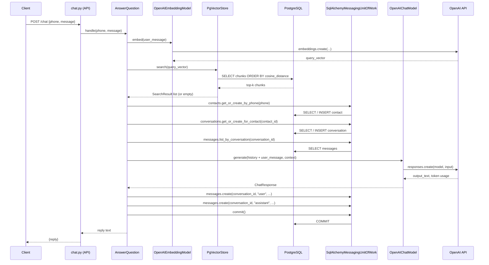
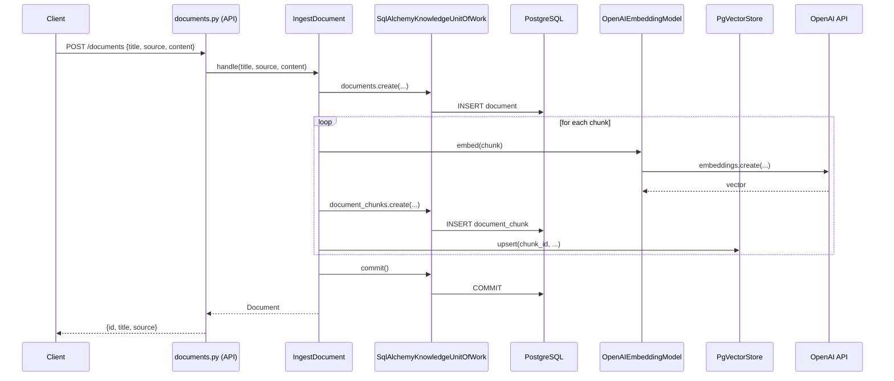

# Development Guide

## Requirements

- Python 3.13+
- Docker & Docker Compose
- uv

## Local Setup

```bash
cp .env.example .env
# Fill in your values

uv sync
docker compose up -d
uv run alembic upgrade head
```

## Running

```bash
uv run uvicorn app.main:app --reload
```

API docs available at `http://localhost:8000/docs`.

## Trying it out

Send a chat message:

```bash
curl -X POST http://localhost:8000/chat \
  -H "Content-Type: application/json" \
  -d '{"phone": "+1234567890", "message": "Hello, what can you help me with?"}'
```

Ingest a document:

```bash
curl -X POST http://localhost:8000/documents \
  -H "Content-Type: application/json" \
  -d '{"title": "My Doc", "source": "manual", "content": "Your document text here..."}'
```

Or use the interactive docs at `http://localhost:8000/docs`.

## Environment Variables

| Variable | Description |
|----------|-------------|
| `DATABASE_URL` | PostgreSQL connection string |
| `CHAT_PROVIDER` | Chat provider: `openai`, `ollama`, `openrouter`, `mock` |
| `CHAT_API_KEY` | API key for the chat provider |
| `CHAT_MODEL` | Model name (e.g. `gpt-4o-mini`) |
| `CHAT_BASE_URL` | Optional base URL override for the chat provider |
| `EMBEDDING_PROVIDER` | Embedding provider: `openai`, `ollama`, `mock` |
| `EMBEDDING_API_KEY` | API key for the embedding provider |
| `EMBEDDING_MODEL` | Embedding model name (default: `text-embedding-3-small`) |
| `EMBEDDING_DIMENSIONS` | Embedding vector dimensions (default: `1536`) |
| `EMBEDDING_BASE_URL` | Optional base URL override for the embedding provider |
| `WHATSAPP_TOKEN` | WhatsApp Cloud API token |
| `WHATSAPP_VERIFY_TOKEN` | Webhook verification token |

## Running Tests

```bash
uv run pytest
```

## Linting & Type Checking

```bash
uv run ruff check .
uv run mypy app/
uv run lint-imports
```

`lint-imports` enforces Clean Architecture import boundaries. Contracts are defined in `pyproject.toml` under `[tool.importlinter]`. A violation fails the build.

## Dependency Audit

```bash
uv audit --preview-features audit-command
```

Checks all dependencies against the OSV vulnerability database.

## Conventions

### Code Style

- Follow existing project patterns — do not refactor unless explicitly asked.
- All new classes and methods must have Google-style docstrings.
- All function parameters must have type annotations.
- Use `X | None` instead of `Optional[X]`.
- Do not use `from __future__ import annotations`.

### Logging

- Declare a module-level logger: `logger = logging.getLogger(__name__)`
- Use `%s`-style formatting — never f-strings in log calls.
- Never log passwords, tokens, secrets, or full request bodies.

### Database

- All models define their own UUID primary key explicitly.
- Each model field must have a comment explaining its purpose.
- All schema changes are managed through Alembic migrations in `infrastructure/database/sqlalchemy/migrations/versions/`.

## Project Structure

```
app/
    api/          # Route handlers
    application/  # Use cases and ports
        models/   # Application-layer value objects
        ports/    # Interfaces for infrastructure dependencies
            repositories/  # One abstract repo per aggregate root
            unit_of_work/  # Domain-scoped transactional boundaries
    config/       # Settings and environment configuration
    domain/       # Domain models and business logic
    infrastructure/
        ai/           # Chat and embedding provider implementations
        database/
            sqlalchemy/ # Models, repositories, migrations, and PostgreSQL engine
            sqlite/     # In-memory SQLite engine for tests
        vectorstores/ # Vector store implementations (pgvector)
        whatsapp/     # WhatsApp Cloud API integration
    schemas/      # Pydantic schemas

tests/
    api/              # mirrors app/api/
    application/      # mirrors app/application/
    infrastructure/   # mirrors app/infrastructure/
    conftest.py       # shared fixtures

docs/
    adr/          # Architecture Decision Records
```

## Request Flows

### POST /chat



### POST /documents



## Decision Tracking

Architectural decisions are tracked in `docs/adr/` — formal, accepted, and binding decisions.

Always consult before implementing a new feature.
