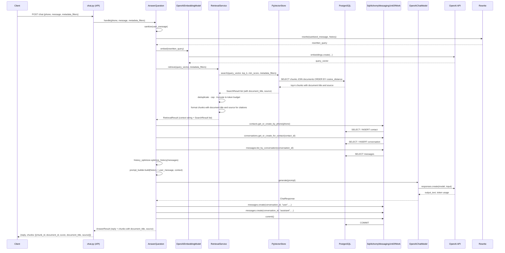
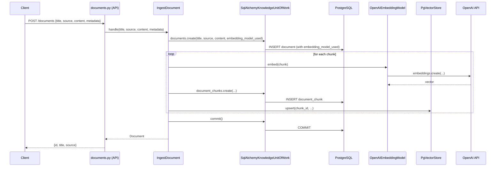

# Development Guide

## Requirements

- Python 3.14+
- Docker & Docker Compose
- uv

## Local Setup

```bash
cp .env.example .env
# Fill in your values

uv sync --extra otel
docker compose up -d
uv run alembic upgrade head
```

## Running

```bash
uv run uvicorn app.main:app --reload
```

API docs available at `http://localhost:8000/docs`.

## Trying it out

Send a chat message:

```bash
curl -X POST http://localhost:8000/chat \
  -H "Content-Type: application/json" \
  -d '{"phone": "+1234567890", "message": "Hello, what can you help me with?"}'
```

Ingest a document:

```bash
curl -X POST http://localhost:8000/documents \
  -H "Content-Type: application/json" \
  -d '{"title": "My Doc", "source": "manual", "content": "Your document text here...", "metadata": {"lang": "en", "dept": "HR"}, "knowledge_base_id": "00000000-0000-0000-0000-000000000000"}'
```

Create a knowledge base:

```bash
curl -X POST http://localhost:8000/knowledge-bases \
  -H "Content-Type: application/json" \
  -d '{"name": "HR Policies", "description": "Human resources policies and procedures"}'
```

List knowledge bases:

```bash
curl -X GET http://localhost:8000/knowledge-bases
```

Or use the interactive docs at `http://localhost:8000/docs`.

## Environment Variables

| Variable | Description |
|----------|-------------|
| `DATABASE_URL` | PostgreSQL connection string |
| `CHAT_PROVIDER` | Chat provider: `openai`, `ollama`, `openrouter`, `mock` |
| `CHAT_API_KEY` | API key for the chat provider |
| `CHAT_MODEL` | Model name (e.g. `gpt-4o-mini`) |
| `CHAT_BASE_URL` | Optional base URL override for the chat provider |
| `EMBEDDING_PROVIDER` | Embedding provider: `openai`, `ollama`, `mock` |
| `EMBEDDING_API_KEY` | API key for the embedding provider |
| `EMBEDDING_MODEL` | Embedding model name (default: `text-embedding-3-small`) |
| `EMBEDDING_DIMENSIONS` | Embedding vector dimensions (default: `1536`) |
| `EMBEDDING_BASE_URL` | Optional base URL override for the embedding provider |
| `RETRIEVAL_TOP_K` | Number of chunks to request from the vector store (default: `5`) |
| `RETRIEVAL_MIN_SCORE` | Maximum cosine distance to accept — lower is stricter (default: unset) |
| `RETRIEVAL_MAX_CHUNKS` | Maximum deduplicated chunks included in context (default: `5`) |
| `RETRIEVAL_MAX_CONTEXT_TOKENS` | Token budget for assembled context (default: `2000`) |
| `RETRIEVAL_ENCODING` | tiktoken encoding for token counting (default: `cl100k_base`) |
| `RETRIEVAL_MODE` | Retrieval strategy: `vector` for pure cosine similarity, `hybrid` for vector + full-text search fused via RRF (default: `vector`) |
| `RETRIEVAL_HYBRID_FTS_LANGUAGE` | PostgreSQL FTS language configuration used in hybrid mode (default: `english`) |
| `RETRIEVAL_HYBRID_RRF_K` | RRF smoothing constant used in hybrid mode — higher values reduce the impact of rank differences (default: `60`) |
| `WHATSAPP_TOKEN` | WhatsApp Cloud API token |
| `WHATSAPP_VERIFY_TOKEN` | Webhook verification token |
| `CORS_ORIGINS` | Comma-separated list of allowed CORS origins (default: empty, which denies all) |
| `SECURITY_HEADERS_ENABLED` | Enable or disable security headers (default: `true`) |
| `SECURITY_HEADERS_CONTENT_SECURITY_POLICY` | Content-Security-Policy header value (default: `default-src 'none'; frame-ancestors 'none'`) |
| `SECURITY_HEADERS_X_CONTENT_TYPE_OPTIONS` | X-Content-Type-Options header value (default: `nosniff`) |
| `SECURITY_HEADERS_X_FRAME_OPTIONS` | X-Frame-Options header value (default: `DENY`) |
| `SECURITY_HEADERS_STRICT_TRANSPORT_SECURITY` | Strict-Transport-Security header value (default: `max-age=31536000; includeSubDomains`) |
| `SECURITY_HEADERS_REFERRER_POLICY` | Referrer-Policy header value (default: `strict-origin-when-cross-origin`) |
| `RATE_LIMIT_ENABLED` | Enable or disable rate limiting (default: `true`) |
| `RATE_LIMIT_DEFAULT` | Default rate limit per minute (default: `60`) |

## Running Tests

```bash
uv run pytest
```

## Linting & Type Checking

```bash
uv run ruff check .
uv run mypy app/
uv run lint-imports
```

`lint-imports` enforces Clean Architecture import boundaries. Contracts are defined in `pyproject.toml` under `[tool.importlinter]`. A violation fails the build.

## Dependency Audit

```bash
uv audit --preview-features audit-command
```

Checks all dependencies against the OSV vulnerability database.

## Conventions

### Code Style

- Follow existing project patterns — do not refactor unless explicitly asked.
- All new classes and methods must have Google-style docstrings.
- All function parameters must have type annotations.
- Use `X | None` instead of `Optional[X]`.
- Do not use `from __future__ import annotations`.

### Logging

- Declare a module-level logger: `logger = logging.getLogger(__name__)`
- Use `%s`-style formatting — never f-strings in log calls.
- Never log passwords, tokens, secrets, or full request bodies.
- For security-relevant events, use `log_security_event()` from `app/application/shared/security/logger.py` instead of the module logger. Event names must follow the `<namespace>.<event>` convention (e.g. `support.message_rejected`, `http.rate_limit_exceeded`). See [Security Controls](security.md) for the full event reference.

### Database

- All models define their own UUID primary key explicitly.
- Each model field must have a comment explaining its purpose.
- All schema changes are managed through Alembic migrations in `infrastructure/database/sqlalchemy/migrations/versions/`.

## Project Structure

```
app/
    api/          # HTTP request handlers and response mapping
    application/  # Use cases, ports, and domain services
        shared/   # Cross-cutting concerns: events, ports, security, base use cases
            security/ # Application-layer security utilities
        <domain>/ # One sub-package per business domain
            models/       # Application-layer value objects
            ports/        # Abstract interfaces for infrastructure dependencies
                repositories/  # One abstract repo per aggregate root
                unit_of_work/  # Domain-scoped transactional boundaries
            services/     # Shared application-layer services
            use_cases/    # One module per user-facing action
    cli/          # CLI entry point and command definitions
        commands/   # Command group modules
        context.py  # Request context (container + session lifecycle)
    config/       # Settings, logging, and telemetry configuration
    container/    # Composition Root — wires domain containers together
    domain/       # Domain models and business logic
    infrastructure/
        ai/           # LLM and embedding provider implementations
            chat/         # Chat model providers
            chunking/     # Text chunking strategies
            embeddings/   # Embedding provider implementations
            history_policies/ # Conversation retention policies
            message_sanitizer/ # User input sanitization
            mock/         # Mock providers for testing
            prompt_builder/ # Prompt assembly from history and context
            tools/    Tool registry, decorator, and tool implementations
        analytics/    Analytics event handlers
        database/
            sqlalchemy/ # SQLAlchemy models, repositories, migrations, engines
                migrations/ # Alembic migration scripts
                postgresql/ # PostgreSQL engine, models, repositories, UoW
                sqlite/     # SQLite engine for tests
        events/       # Domain event publishing
        middleware/   # ASGI middleware (security, rate limiting, request sizing)
        observability/ # OpenTelemetry instrumentation
        routers/      # CRUD router implementations
        security/     # Security infrastructure
        vectorstores/ # Vector store implementations
            fake/           # In-process vector store for testing
            pgvector/       # pgvector adapter
            params_builders/ # SearchParamsBuilder implementations and registry
    schemas/      # Pydantic request/response validation schemas

tests/
    api/              # Endpoint and integration tests
    application/      # Pure logic tests for use cases and services
    infrastructure/   # Adapter and tool tests
        middleware/   # Middleware tests
    conftest.py       # Shared test fixtures

docs/
    adr/          # Architecture Decision Records
    guidelines/   # Pattern reference guides
    vision.md       # Product vision and strategic direction
```

## Request Flows

### POST /chat


```mermaid
sequenceDiagram
    participant Client
    participant Router as chat.py (API)
    participant UC as AnswerQuestion
    participant Embed as OpenAIEmbeddingModel
    participant RS as RetrievalService
    participant VS as PgVectorStore
    participant DB as PostgreSQL
    participant UoW as SqlAlchemyMessagingUnitOfWork
    participant LLM as OpenAIChatModel
    participant OpenAI as OpenAI API

    Client->>Router: POST /chat {phone, message, metadata_filters}
    Router->>UC: handle(phone, message, metadata_filters)
    UC->>UC: sanitize(user_message)
    UC->>Rewrite: rewrite(sanitized_message, history)
    Rewrite-->>UC: rewritten_query
    UC->>Embed: embed(rewritten_query)
    Embed->>OpenAI: embeddings.create(...)
    OpenAI-->>Embed: query_vector
    UC->>RS: retrieve(query_vector, metadata_filters)
    RS->>VS: search(query_vector, top_k, min_score, metadata_filters)
    VS->>DB: SELECT chunks JOIN documents ORDER BY cosine_distance
    DB-->>VS: top-k chunks with document title and source
    VS-->>RS: SearchResult list (with document_title, source)
    RS->>RS: deduplicate · cap · truncate to token budget
    RS->>RS: format chunks with document title and source for citations
    RS-->>UC: RetrievalResult (context string + SearchResult list)
    UC->>UoW: contacts.get_or_create_by_phone(phone)
    UoW->>DB: SELECT / INSERT contact
    UC->>UoW: conversations.get_or_create_for_contact(contact_id)
    UoW->>DB: SELECT / INSERT conversation
    UC->>UoW: messages.list_by_conversation(conversation_id)
    UoW->>DB: SELECT messages
    UC->>UC: history_optimizer.optimize_history(messages)
    UC->>UC: prompt_builder.build(history + user_message, context)
    UC->>LLM: generate(prompt)
    LLM->>OpenAI: responses.create(model, input)
    OpenAI-->>LLM: output_text, token usage
    LLM-->>UC: ChatResponse
    UC->>UoW: messages.create(conversation_id, "user", ...)
    UC->>UoW: messages.create(conversation_id, "assistant", ...)
    UC->>UoW: commit()
    UoW->>DB: COMMIT
    UC-->>Router: AnswerResult (reply + chunks with document_title, source)
    Router-->>Client: {reply, chunks: [{chunk_id, document_id, score, document_title, source}]}
```

### POST /documents


```mermaid
sequenceDiagram
    participant Client
    participant Router as documents.py (API)
    participant UC as IngestDocument
    participant UoW as SqlAlchemyKnowledgeUnitOfWork
    participant DB as PostgreSQL
    participant Embed as OpenAIEmbeddingModel
    participant VS as PgVectorStore
    participant OpenAI as OpenAI API

    Client->>Router: POST /documents {title, source, content, metadata}
    Router->>UC: handle(title, source, content, metadata)
    UC->>UoW: documents.create(title, source, content, embedding_model_used)
    UoW->>DB: INSERT document (with embedding_model_used)
    loop for each chunk
        UC->>Embed: embed(chunk)
        Embed->>OpenAI: embeddings.create(...)
        OpenAI-->>Embed: vector
        UC->>UoW: document_chunks.create(...)
        UoW->>DB: INSERT document_chunk
        UC->>VS: upsert(chunk_id, ...)
    end
    UC->>UoW: commit()
    UoW->>DB: COMMIT
    UC-->>Router: Document
    Router-->>Client: {id, title, source}
```

## Security Controls

Implemented security controls are documented in [docs/security.md](security.md).

## Decision Tracking

Architectural decisions are tracked in `docs/adr/` — formal, accepted, and binding decisions.

Always consult before implementing a new feature.
