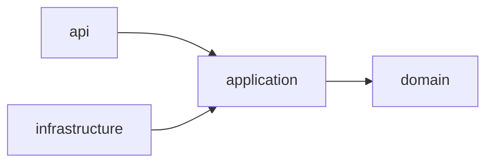

# Clean Architecture

This document describes how to work within the project's Clean Architecture. For the architectural decision behind this structure, see [ADR-001](../adr/001-clean-architecture.md).

## Project Structure

The following is the default directory layout under `app/`. Each directory maps to a single layer with a well-defined responsibility.

```
app/
├── api/              # Route handlers
├── application/      # Use cases
│   ├── ports/        # Interfaces for infrastructure dependencies
│   └── <domain>/
│       └── <use_case>.py
├── config/           # Settings and configuration
├── domain/           # Domain models and business logic
├── infrastructure/   # External clients (DB engine, LLM, etc.)
│   ├── ai/
│   │   ├── chat/     # Chat completion provider implementations
│   │   ├── embeddings/ # Embedding provider implementations
│   │   └── mock/     # Mock implementations for testing
│   └── database/     # Models, repositories, and migrations
├── schemas/          # Pydantic request/response schemas
└── main.py
```

## Dependency Rule

Dependencies flow inward only. Outer layers may import from inner layers; inner layers must never import from outer layers.



`infrastructure` is an outer layer — it implements ports defined by `application` and may import from `application` and `domain`, but `application` and `domain` must never import from `infrastructure`.

## Where to Put New Code

### Adding a new endpoint

Create a route handler in `app/api/`. The handler must:

1. Parse and validate the request using a schema from `app/schemas/`.
2. Call the application layer to execute the use case.
3. Return the response.

```python
# app/api/my_resource.py
@router.post("/my-resource", response_model=MyResponseSchema)
def create(payload: MySchema, db: Session = Depends(get_db)) -> MyResponseSchema:
    use_case = MyUseCase(uow=SqlAlchemyUnitOfWork(db), client=_my_client)
    return MyResponseSchema(field=use_case.handle(payload.field))
```

### Adding a new use case

Create a use case class in `app/application/<domain>/`. The class must:

1. Coordinate repositories and infrastructure clients to fulfill the use case.
2. Call `uow.commit()` once at the end — the use case owns the transaction boundary.

```python
# app/application/my_domain/do_something.py
class DoSomething:
    def __init__(self, uow: UnitOfWork) -> None:
        self._uow = uow

    def handle(self, value: str) -> str:
        entity = self._uow.my_entities.create(value)
        self._uow.commit()
        return entity.field
```

### Adding a new database query

Add a method to the relevant repository in `app/infrastructure/database/repositories/`. See [Writing Repositories](writing-repositories.md) for the full implementation guide.

### Adding a new external integration

Create a client in `app/infrastructure/`. The application layer calls it; the infrastructure layer must not call back into the application layer.

## Adding a New Domain End-to-End

When adding a full new domain, follow these steps in order:

1. Create the model in `app/infrastructure/database/models/<domain>.py` — see [Writing Database Models](writing-database-models.md).
2. Generate and apply the migration: `uv run alembic revision --autogenerate -m "create <domain> table" && uv run alembic upgrade head`.
3. Create the repository in `app/infrastructure/database/repositories/<domain>.py` — see [Writing Repositories](writing-repositories.md).
4. Create the use case in `app/application/<domain>/<use_case>.py` — see [Writing Use Cases](writing-use-cases.md).
5. Create the schemas in `app/schemas/<domain>.py` — see [Writing Request Schemas](writing-request-schemas.md).
6. Create the endpoint in `app/api/<domain>.py`.
7. Register the router in `app/main.py`:

```python
from app.api.<domain> import router as <domain>_router

app.include_router(<domain>_router)
```

## What Not to Do

- Do not call `db.commit()` inside a repository — only the use case commits.
- Do not put query logic in `app/api/` or `app/application/` — all DB access goes through repositories.
- Do not import from `app/api/` or `app/application/` inside `app/infrastructure/`.

## Rules

- `app/domain/` must not import from any other `app/` layer.
- `app/application/` must only import from `app/domain/` and `app/application/` — never from `app/infrastructure/` or `app/api/`.
- `app/infrastructure/` must not import from `app/api/`.
- Every external dependency used by the application layer must have a port defined in `app/application/ports/` before any infrastructure code is written.
- Dependencies are injected at the composition root (`app/api/` route handlers) — never instantiated inside use cases or domain objects.
